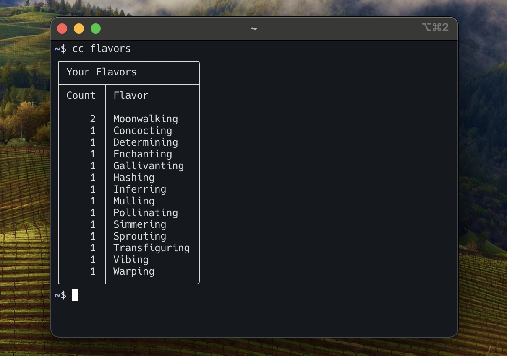

# cc-flavors




> Tiny **tmux hook** that Collects "flavor texts" shown by Claude Code (e.g. `Moonwalking…`).

## Install

### Quick start

1. Install the binary

```bash
go install github.com/takuto-yamamoto/cc-flavors@latest
```

2. Install the tmux plugin (TPM)

Add to `.tmux.conf`:

```conf
set -g @plugin 'takuto-yamamoto/cc-flavors'
run '~/.tmux/plugins/tpm/tpm'
```

Reload tmux, then press `prefix + I` to install.

3. Start Claude Code

Then use Claude Code as usual.

If you wrap the `claude` command, set `@cc_flavors_cmd` in **Options** below.

### Alternative install

#### Binary via tar.gz

Download the release archive for your platform, then put `cc-flavors` on `PATH`.

#### tmux plugin (manual)

```bash
git clone https://github.com/takuto-yamamoto/cc-flavors.git ~/.tmux/plugins/cc-flavors
```

Add to `.tmux.conf`:

```conf
run '~/.tmux/plugins/cc-flavors/cc-flavors.tmux'
```

## Usage

See `cc-flavors --help` for the full command list and options.

### tmux Options

Set in `.tmux.conf`:

```conf
# The command name to watch in tmux panes (default: `claude`).
set -g @cc_flavors_cmd "claude"

# Scan interval in seconds (default: `1`).
set -g @cc_flavors_scan_interval "1"
```

### Examples

```bash
# Show summary
cc-flavors

# Filter by date
cc-flavors --since 2025-02-14

# Clear all counts (with confirmation)
cc-flavors clear
```

## Limitations

- `cc-flavors` watches panes running the configured command (default: `claude`) and collects any on-screen lines that match the flavor-text pattern.
- If you want a "pure" collection, avoid customizing or disabling Claude Code's flavor texts.

## Author

@takuto-yamamoto (a.k.a. tarte)

## License

MIT
